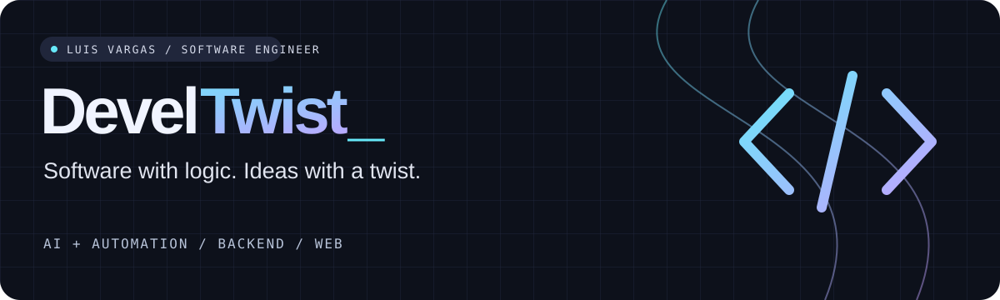

<p align="center">
  
</p>

<h1 align="center">Hola, soy Luis 👋</h1>
<p align="center"><strong>Senior Full Stack Engineer · IA, Laravel e integraciones</strong><br/>Desde Venezuela, construyendo con equipos remotos.</p>

<p align="center">
  <a href="https://www.develtwist.com/es">🌐 Mi portafolio</a> ·
  <a href="https://www.linkedin.com/in/luisfvargas/">💬 Conectemos</a> ·
  <a href="https://www.upwork.com/freelancers/developtwist">🚀 Trabajemos juntos</a>
</p>

---

## 🧩 Del «¿y si…?» al «ya funciona»

Soy ingeniero en Informática con **más de 7 años de experiencia** construyendo SaaS, plataformas web y eCommerce. Mi trabajo conecta arquitectura, código y procesos de negocio: desde un backend en Laravel hasta una integración que hace que varias herramientas trabajen juntas.

He liderado backend para telehealth, implementado agentes de IA y automatizaciones, y desarrollado soluciones a medida con WordPress y Shopify. Me interesa la parte donde una idea se convierte en un sistema útil.

```text
develtwist@work:~$ build --idea "¿podemos conectar todo esto?"

  [1] Entender el problema
  [2] Diseñar las piezas
  [3] Conectar APIs, datos y personas
  [4] Probar lo que pasa cuando algo falla
  [5] Entregar y seguir mejorando

  > El webhook llegó dos veces. La operación debería ocurrir una. 🙂
```

## 🛠️ Elige tu misión

| Si necesitas… | Aquí puedo aportar |
| :--- | :--- |
| **IA con una tarea concreta** | Agentes, APIs generativas, prompt engineering y automatización de procesos. |
| **Un backend con muchas piezas** | Laravel, APIs, colas, webhooks e integraciones para SaaS y telehealth. |
| **Pasar de idea a plan técnico** | Arquitectura, definición de alcance, planificación y liderazgo técnico. |
| **Una web que haga más que verse bien** | WordPress a medida, WooCommerce, Shopify B2B y conexiones con otras plataformas. |

## 🎮 Algunas misiones del historial

**🏥 Telehealth · backend y liderazgo**  
Lideré el backend de un SaaS multi-tenant en un equipo de dos personas, trabajando con integraciones, colas y webhooks confiables. Experiencia descrita de forma general por confidencialidad.  
`Laravel` `MySQL` `Redis` `AWS` · [Contexto en mi portafolio](https://www.develtwist.com/es#projects)

**⚽ PIJA Quiniela · proyecto compartido**  
Co-construí con un colega una aplicación de predicciones deportivas con clasificaciones en vivo y actualizaciones en tiempo real. El fútbol pone la incertidumbre; el código pone las reglas.  
`Next.js` `TypeScript` `Supabase` `PostgreSQL` · [Ver el proyecto en mi portafolio](https://www.develtwist.com/es#projects)

**🏍️ Moto Travel Tour · desarrollo y puesta en marcha**  
Desarrollé una plataforma de viajes con mapas, búsqueda de tours y funcionalidades a medida. También me encargué de servidor, dominio y despliegue, colaborando con un diseñador.  
`WordPress` `PHP` `Leaflet` · [Visitar sitio](https://mototraveltour.com/)

**🌌 DevelTwist · mi rincón de internet**  
Diseñé y desarrollé mi portafolio en inglés, español y francés con Astro, contenido reutilizable y una identidad visual propia.  
`Astro` `TypeScript` `CSS` · [Explorar](https://www.develtwist.com/es)

## 🧰 Caja de herramientas

| Área | Tecnologías con las que he trabajado |
| :--- | :--- |
| Backend | PHP · Laravel · Node.js · Python |
| Frontend | JavaScript · TypeScript · Vue · React / Next.js · Astro · Tailwind CSS |
| Datos y procesos | MySQL · PostgreSQL · Redis · Supabase · APIs · Webhooks |
| CMS y comercio | WordPress · WooCommerce · Shopify |
| Calidad y entrega | PHPUnit · Playwright · Vitest · GitHub Actions · Docker |

<details>
<summary><strong>🧪 Side quest: una tesis con redes neuronales</strong></summary>

Para mi tesis de Ingeniería en Informática construí un pipeline de estimación de esfuerzo de tareas: datos de tiempo, características derivadas con LLMs y un modelo de regresión con Keras/TensorFlow. Fue un proyecto académico, defendido y aprobado en la UNET.

Sí: intenté enseñarle a una red neuronal a responder «¿cuánto tarda esto?». Una pregunta con más dificultad de la que aparenta.

</details>

## 🤝 ¿Qué construimos?

Una idea, una integración rebelde o un equipo que necesita apoyo técnico: **cuéntame qué quieres resolver**.

Puedes empezar con: *«Luis, estamos construyendo ___ y nos está frenando ___».*

**[Hablemos por LinkedIn →](https://www.linkedin.com/in/luisfvargas/)**  
¿Ya tienes un proyecto definido? **[Encuéntrame en Upwork →](https://www.upwork.com/freelancers/developtwist)**

<p align="center"><sub>Software con lógica. Ideas con twist.</sub></p>
